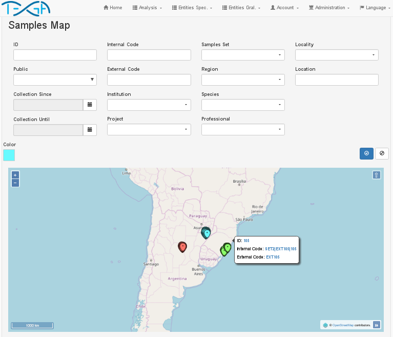

 

# TEGA (Tools for Evolutionary and Genetic Analysis)
TEGA is a WEB platform designed for the management of biological data, with emphasis on population genetics studies. This platform is free and any research group can install it in their institute, and modify it.

- TEGA objectives are:
    * Facilitating data management.
    * Providing a way to execute the analysis procedures.
    * Supplying a means to publish data, procedures and results.

In the [manual](manual/) folder there are the manuals that mention the characteristics of TEGA and the instructions for its use and installation.

## Citation
To cite TEGA, the following article should be referenced:
> Dario E. Elias and Eva C. Rueda. 2018. Tools for Evolutionary and Genetic Analysis (TEGA): A new platform for the management of molecular and environmental data. ... (in publication)

## License
Copyright (C) 2018 Dario E. Elias & Eva C. Rueda

TEGA is licensed under [GNU AGPL v3](https://www.gnu.org/licenses/agpl-3.0.en.html)

TEGA includes, under the permission of section 7 of GNU AGPL v3, the programs
STRUCTURE, DISTRUCT and CLUMPP, which are not strictly free. We will work
to include free alternatives to those programs in the following versions
of TEGA.

The TEGA logo was designed by Ernesto Goddio and is licensed under [CC BY 4.0](https://creativecommons.org/licenses/by/4.0/)

## Screenshots

 
    

 
    

 
    

 
    

 
    

 
    

 
    

 
    

 
    

 
    

 
    

 
    

